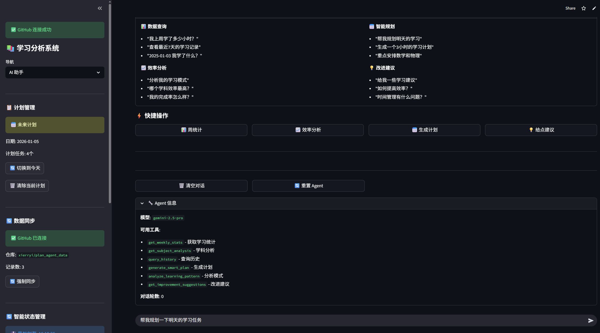
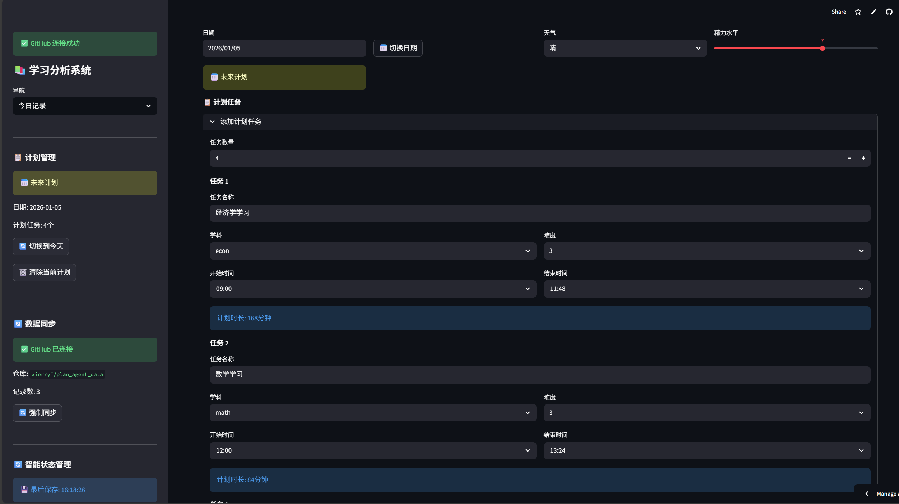
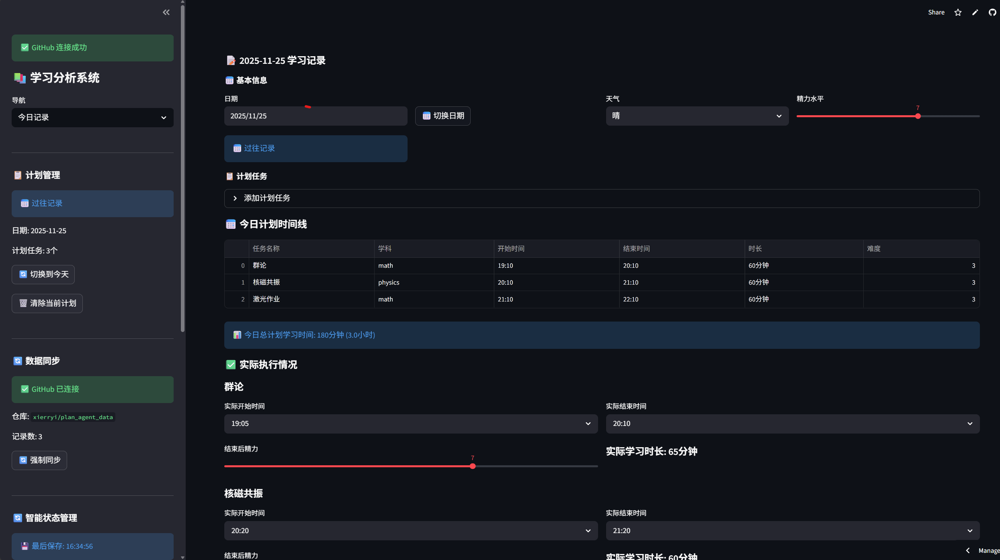
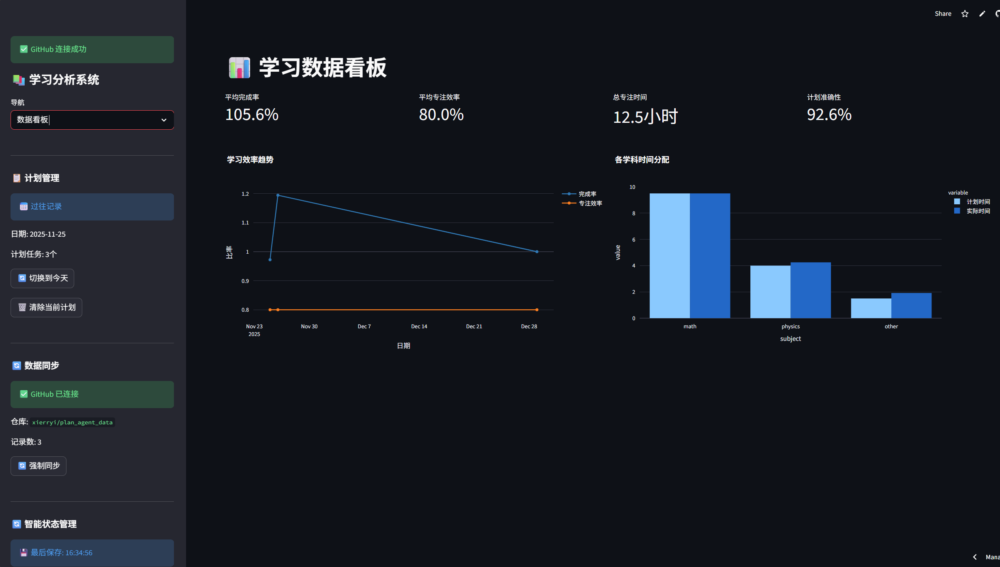
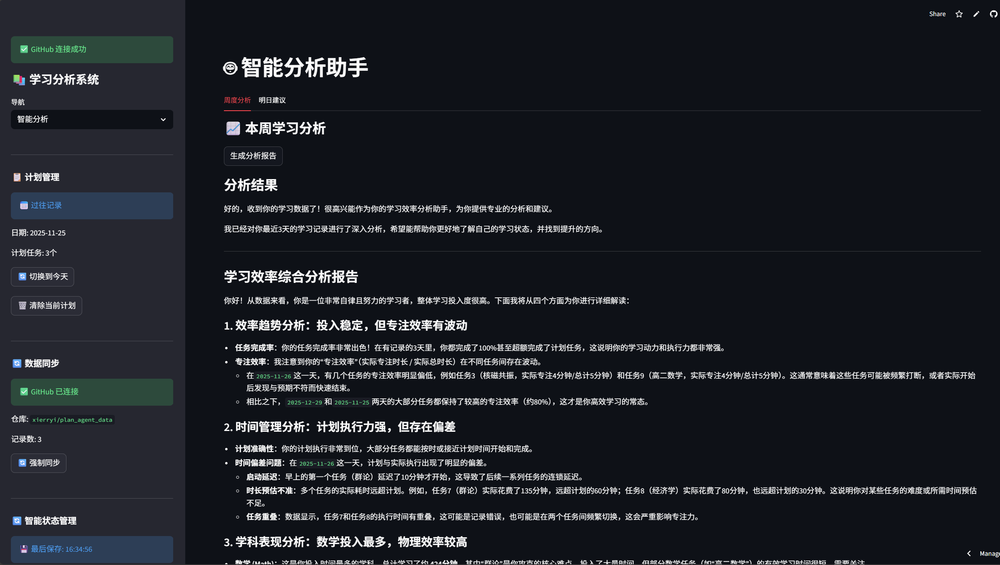

# 📚 StudyAgent - 智能学习效率分析 AI Agent

> 基于大语言模型的学习计划管理与效率分析智能助手

[](https://plan-agent.streamlit.app/)
[](https://www.python.org/downloads/)
[](https://opensource.org/licenses/MIT)

---

## 📖 项目背景

### 问题描述

在日常学习中，学生常常面临以下挑战：
- **计划制定困难**：不知道如何合理分配各学科的学习时间
- **效率难以量化**：无法客观评估自己的学习效率和完成情况
- **缺乏数据分析**：没有工具帮助发现学习模式和薄弱环节
- **建议不够个性化**：通用的学习建议难以针对个人情况

### 解决方案

**StudyAgent** 是一个基于 AI Agent 的学习效率管理系统，它能够：

1. **智能分析学习数据** - 自动分析学习时间、完成率、效率趋势
2. **自主调用工具** - AI 根据用户问题自动选择合适的分析工具
3. **生成个性化建议** - 基于历史数据提供针对性的改进建议
4. **一键生成学习计划** - 结合历史表现智能规划每日任务

---

## 🏗️ 系统架构

```
┌─────────────────────────────────────────────────────────────┐
│                      用户界面 (Streamlit)                    │
├─────────────────────────────────────────────────────────────┤
│  今日记录  │  AI 助手  │  数据看板  │  智能分析  │  历史数据  │
└─────────────────────────────────────────────────────────────┘
                              │
                              ▼
┌─────────────────────────────────────────────────────────────┐
│                    AI Agent (study_agent.py)                 │
│  ┌─────────────────────────────────────────────────────┐   │
│  │              OpenAI Function Calling                 │   │
│  │   用户问题 → AI分析 → 决定调用工具 → 执行 → 回复     │   │
│  └─────────────────────────────────────────────────────┘   │
└─────────────────────────────────────────────────────────────┘
                              │
                              ▼
┌─────────────────────────────────────────────────────────────┐
│                     工具集 (tools.py)                        │
│  ┌───────────────┐ ┌───────────────┐ ┌───────────────┐     │
│  │get_weekly_stats│ │get_subject_   │ │query_history  │     │
│  │ 学习统计      │ │analysis 学科分析│ │ 历史查询     │     │
│  └───────────────┘ └───────────────┘ └───────────────┘     │
│  ┌───────────────┐ ┌───────────────┐ ┌───────────────┐     │
│  │generate_smart_│ │analyze_learning│ │get_improvement│     │
│  │plan 智能规划  │ │pattern 模式分析│ │suggestions建议│     │
│  └───────────────┘ └───────────────┘ └───────────────┘     │
└─────────────────────────────────────────────────────────────┘
                              │
                              ▼
┌─────────────────────────────────────────────────────────────┐
│                    数据层                                    │
│  ┌─────────────────┐    ┌─────────────────┐                │
│  │  本地存储       │    │  GitHub 云端同步 │                │
│  │  (JSONL)        │    │  (API)          │                │
│  └─────────────────┘    └─────────────────┘                │
└─────────────────────────────────────────────────────────────┘
```

---

## 🤖 AI Agent 核心设计

### Function Calling 机制

本项目采用 OpenAI 的 **Function Calling** 能力实现 AI Agent 的工具调用：

```python
# 1. 定义工具
tools = [
    {
        "type": "function",
        "function": {
            "name": "get_weekly_stats",
            "description": "获取最近一周的学习统计数据",
            "parameters": {...}
        }
    },
    # ... 更多工具
]

# 2. AI 自主决策调用
response = client.chat.completions.create(
    model="gpt-4o-mini",
    messages=messages,
    tools=tools,
    tool_choice="auto"  # AI 自主决定是否调用工具
)

# 3. 执行工具并返回结果
if response.tool_calls:
    result = execute_tool(tool_name, arguments)
    # 将结果返回给 AI 生成最终回复
```

### 工具列表

| 工具名称 | 功能描述 | 示例问题 |
|---------|---------|---------|
| `get_weekly_stats` | 获取学习统计数据 | "这周学了多少小时？" |
| `get_subject_analysis` | 分析特定学科表现 | "数学学得怎么样？" |
| `query_history` | 查询历史学习记录 | "1月3号学了什么？" |
| `generate_smart_plan` | 智能生成学习计划 | "帮我规划明天" |
| `analyze_learning_pattern` | 分析学习模式规律 | "我有什么学习规律？" |
| `get_improvement_suggestions` | 获取个性化建议 | "怎么提高效率？" |
| `compare_periods` | 对比不同时段表现 | "这周和上周比怎么样？" |

---

## ✨ 功能特性

### 1. 📝 今日记录
- 记录每日学习任务（任务名、学科、时间、难度）
- 追踪实际执行情况
- 支持多日期切换和未来计划

### 2. 🤖 AI 助手
- **对话式交互**：自然语言提问，AI 智能回答
- **工具自动调用**：AI 根据问题自动选择分析工具
- **一键生成计划**：设置时长和重点学科，自动填入任务表单
- **快捷操作按钮**：周统计、效率分析、生成计划、建议

### 3. 📊 数据看板
- 完成率和专注效率趋势图
- 各学科时间分配对比
- 核心指标卡片展示

### 4. 🔍 智能分析
- AI 周度学习分析报告
- 明日计划智能建议

### 5. 📚 历史数据
- 浏览过往学习记录
- 查看每日详细信息和反思

### 6. ☁️ 云端同步
- GitHub 作为数据库
- 多设备数据同步
- 自动版本控制

---

## 🚀 快速开始

### 环境要求

- Python 3.9+
- OpenAI API Key

### 安装步骤

```bash
# 1. 克隆项目
git clone https://github.com/xierryi/plan_agent.git
cd plan_agent/study_dashboard

# 2. 创建虚拟环境（推荐）
python -m venv venv
source venv/bin/activate  # Linux/Mac
# 或 venv\Scripts\activate  # Windows

# 3. 安装依赖
pip install -r requirements.txt

# 4. 配置环境变量
# 创建 .env 文件
echo "OPENAI_API_KEY=your_api_key_here" > .env
echo "OPENAI_BASE_URL=https://api.openai.com/v1" >> .env
echo "MODEL_NAME=gpt-4o-mini" >> .env

# 5. 运行应用
streamlit run app.py
```

### 在线体验

直接访问部署在 Streamlit Cloud 的应用：
**https://plan-agent.streamlit.app/**

---

## 📁 项目结构

```
study_dashboard/
├── app.py                  # 主应用入口，Streamlit UI
├── study_agent.py          # AI Agent 核心，Function Calling 实现
├── tools.py                # 工具函数定义与实现
├── data_manager.py         # 本地数据管理
├── github_manager.py       # GitHub API 交互
├── github_state_manager.py # 云端状态同步
├── state_manager.py        # 本地状态管理
├── requirements.txt        # Python 依赖
├── README.md               # 项目说明文档
└── .env                    # 环境变量配置（需自行创建）
```

---

## 📊 结果展示

### 1. AI 助手对话与智能规划

*AI 助手通过 Function Calling 自动调用统计工具，并提供个性化建议。*

### 2. 今日学习记录


*简洁的响应式界面，支持任务快速录入和执行情况追踪。*

### 3. 数据看板统计

*自动汇总学习数据，可视化展示效率趋势和学科分布。*

### 4. 智能分析报告

*AI 深度挖掘历史数据，生成专业的周度总结报告。*

---

## 🔧 配置说明

### 环境变量

| 变量名 | 说明 | 示例值 |
|-------|------|-------|
| `OPENAI_API_KEY` | OpenAI API 密钥 | `sk-xxx...` |
| `OPENAI_BASE_URL` | API 端点（可选） | `https://api.openai.com/v1` |
| `MODEL_NAME` | 使用的模型 | `gpt-4o-mini` |
| `GITHUB_TOKEN` | GitHub Personal Token | `ghp_xxx...` |
| `GITHUB_OWNER` | GitHub 用户名 | `username` |
| `GITHUB_REPO` | 仓库名 | `study-data` |

### Streamlit Cloud 部署

1. Fork 本项目到你的 GitHub
2. 在 [Streamlit Cloud](https://streamlit.io/cloud) 创建应用
3. 在 Settings → Secrets 中配置环境变量

---

## 🎯 技术亮点

1. **AI Agent 架构**
   - 使用 OpenAI Function Calling 实现工具自主调用
   - AI 根据用户意图自动选择合适的分析工具
   - 支持多轮对话和上下文记忆

2. **数据驱动的个性化**
   - 基于历史数据分析学习模式
   - 智能识别薄弱学科和效率瓶颈
   - 生成针对性的改进建议

3. **无缝的用户体验**
   - 一键生成计划并自动填入表单
   - 云端同步支持多设备使用
   - 响应式设计支持移动端

---

## 📈 未来展望

- [ ] 添加番茄钟专注计时功能
- [ ] 支持更多学科和自定义标签
- [ ] 集成日历视图
- [ ] 添加学习目标设定和追踪
- [ ] 支持导出学习报告 PDF

---

## 📄 许可证

MIT License - 详见 [LICENSE](LICENSE)

---

## 🙏 致谢

- [Streamlit](https://streamlit.io/) - 优秀的 Python Web 框架
- [OpenAI](https://openai.com/) - 强大的 AI 能力支持
- [Plotly](https://plotly.com/) - 交互式数据可视化

---

<p align="center">
  Made with ❤️ for better learning
</p>

